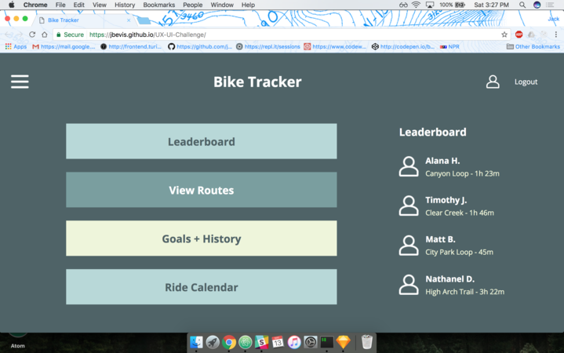
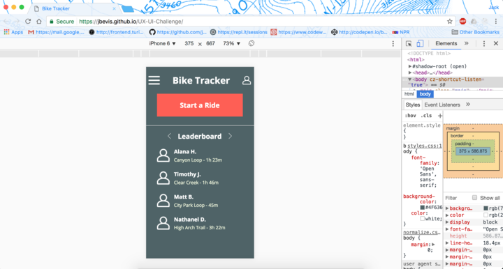
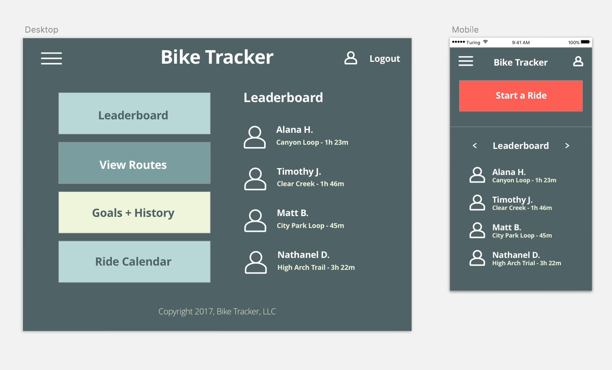

# UX-UI-Challenge

### [Bike Tracker](https://jbevis.github.io/UX-UI-Challenge/)

### Final Product

### Original comp:

### Approach:

We approached the project with the mentality that we would create a flexible base of html and fill it in with responsive css. We also strived to match the comp as specifically as possible.

### Target user:

### Reference and Inspiration:

### Wireframes:
