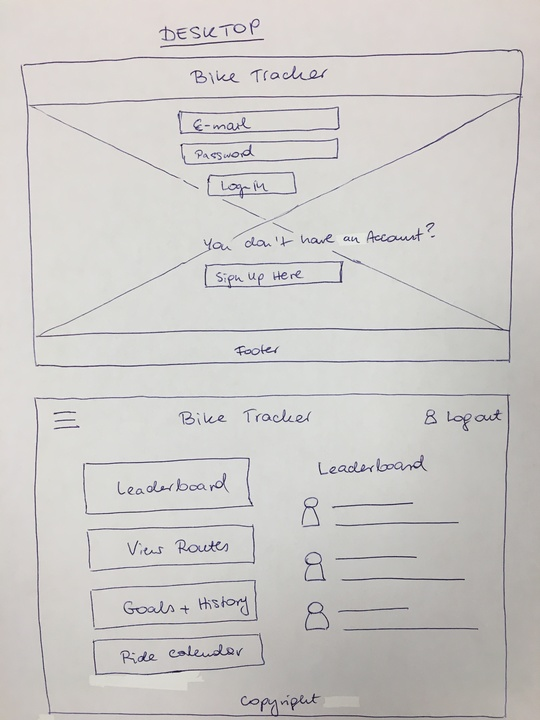
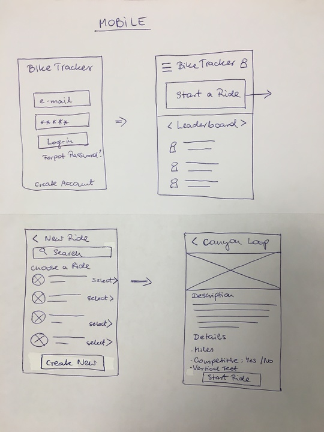

# UX-UI-Challenge

### [Bike Tracker](https://jbevis.github.io/UX-UI-Challenge/)

### Final Product

### Original comp:

### Approach:

We approached the project with the mentality that we would create a flexible base of html and fill it in with responsive css. We also strived to match the comp as specifically as possible.

### Target user:
This product is an App for competitive mountain bikers. It is focused on measuring results. The user wants to know distance, time and difficulty level of different routes, and also be able to compare and compete against other bikers. This is why, we included leaderboard on the first page. There is also a lot of information regarding details of trails on various pages of the App.

### Reference and Inspiration:
-    Strava
-    Endomondo
-    MapMyRide
### Wireframes:
###### Desktop:

###### Mobile:

